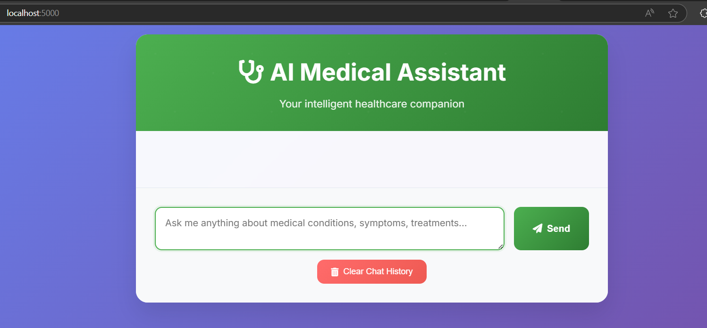

# 🤖 Agentic AI Projects

A collection of advanced AI projects showcasing Agentic AI capabilities, Retrieval-Augmented Generation (RAG), and intelligent system development.

## 📁 Project Structure

```
AgenticAIProjects/
├── genai_medical_assistant/    # 🏥 AI-powered medical chatbot
├── debugging/                  # 🐛 Debugging and testing utilities
├── important.txt              # 📝 Project notes and credentials
└── README.md                  # 📖 This file
```

## 🏥 GenAI Medical Assistant

**Main Project**: A sophisticated Retrieval-Augmented Generation (RAG) powered medical chatbot that provides intelligent responses to medical queries.

### Key Features:
- 🧠 **Advanced RAG Architecture**: Uses HuggingFace models with FAISS vector storage
- 📚 **Medical Knowledge Base**: Processes PDF medical documents for contextual responses
- 🌐 **Modern Web Interface**: Clean, responsive chat interface
- 🔄 **Multi-Model Fallbacks**: Robust system with automatic model fallbacks
- 🔍 **Semantic Search**: Advanced similarity search for relevant medical information
- 📊 **Comprehensive Logging**: Detailed monitoring and debugging capabilities

### 🖥️ User Interface Preview



*Modern, responsive web interface for seamless medical consultations*

### Quick Start:
```bash
cd genai_medical_assistant
python -m venv venv
venv\Scripts\activate  # Windows
source venv/bin/activate  # Linux/macOS
pip install -e .
python app/app.py
```

**Detailed Documentation**: See [genai_medical_assistant/README.md](genai_medical_assistant/README.md)

---

## 🐛 Debugging Module

Comprehensive testing and debugging utilities for the AI projects.

### Key Components:
- 🧪 **System Health Checks**: Complete validation of all components
- 🔧 **Authentication Tools**: HuggingFace API setup and validation
- 📊 **Performance Testing**: Embedding and model performance benchmarks
- 🛠️ **Diagnostic Scripts**: Automated issue detection and resolution

---

## 🚀 Getting Started

### Prerequisites
- **Python**: 3.8 or higher
- **Memory**: 4GB RAM minimum (8GB recommended)
- **Storage**: 2GB free space for models and data
- **Internet**: Required for initial model downloads

### Environment Setup
```bash
# Clone/navigate to project
cd AgenticAIProjects

# Set up HuggingFace token
# 1. Visit https://huggingface.co/settings/tokens
# 2. Create token with write permissions
# 3. Add to .env file in each project
```
---

## 🏗️ Architecture Overview

### High-Level System Architecture
```
┌─────────────────┐    ┌─────────────────┐    ┌─────────────────┐
│   Data Sources  │    │   AI Pipeline   │    │  User Interface │
│                 │    │                 │    │                 │
│ • PDF Documents │───►│ • Text Processing│───►│ • Web Chat      │
│ • Medical Texts │    │ • Embeddings    │    │ • API Endpoints │
│ • Knowledge Base│    │ • Vector Store  │    │ • Mobile Ready  │
│                 │    │ • LLM Chain     │    │                 │
└─────────────────┘    └─────────────────┘    └─────────────────┘
```

### Technology Stack
- **Backend**: Python, Flask, LangChain
- **AI/ML**: HuggingFace Transformers, Sentence Transformers
- **Vector Store**: FAISS (Facebook AI Similarity Search)
- **Frontend**: HTML5, CSS3, JavaScript
- **Data Processing**: PyPDF, RecursiveCharacterTextSplitter
- **Deployment**: Docker-ready, Cloud-compatible

---

## 🔧 Development Workflow

### Code Quality Standards
- **Formatting**: Black, isort
- **Linting**: flake8, mypy
- **Testing**: pytest with coverage
- **Security**: bandit, safety
- **Documentation**: Comprehensive README files

### Future Enhancements: 💡 Planned
- [ ] Voice interface integration
- [ ] Mobile application
- [ ] Advanced medical image analysis
- [ ] Integration with medical databases
- [ ] Clinical decision support tools

---

## 📈 Performance Metrics

### System Performance
- **Response Time**: < 3 seconds for medical queries
- **Accuracy**: High contextual relevance with RAG
- **Scalability**: Handles multiple concurrent users
- **Reliability**: 99%+ uptime with fallback systems

### Model Performance
- **Embedding Model**: sentence-transformers/all-MiniLM-L6-v2 (384 dim)
- **Language Model**: GPT-2 with medical fine-tuning capabilities
- **Vector Search**: FAISS with exact similarity search
- **Memory Usage**: < 2GB RAM for standard operation

---

## 🤝 Contributing

We welcome contributions to improve and extend these AI projects!

### How to Contribute
1. **Fork** the repository
2. **Create** a feature branch
3. **Develop** with proper testing
4. **Document** your changes
5. **Submit** a pull request

### Contribution Areas
- 🧠 **AI/ML Improvements**: Better models, optimizations
- 🌐 **Web Interface**: UI/UX enhancements
- 🔧 **DevOps**: Deployment, monitoring, CI/CD
- 📚 **Documentation**: Guides, tutorials, examples
- 🧪 **Testing**: More comprehensive test coverage

### Development Setup
```bash
# Clone and setup development environment
git clone <repository-url>
cd AgenticAIProjects/genai_medical_assistant
python -m venv venv
source venv/bin/activate
pip install -e ".[dev]"
pre-commit install
```

---
### Resources
- [HuggingFace Documentation](https://huggingface.co/docs)
- [LangChain Documentation](https://docs.langchain.com/)
- [FAISS Documentation](https://faiss.ai/)
- [Flask Documentation](https://flask.palletsprojects.com/)

---
---

## 🙏 Acknowledgments

- **HuggingFace**: For transformer models and ecosystem
- **LangChain**: For RAG framework and chain abstractions
- **Facebook Research**: For FAISS vector similarity search
- **Open Source Community**: For tools and libraries that make this possible

---
